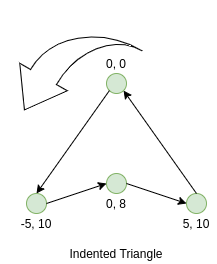

Every basic shape in `C-Turtle` is a set of coordinates. Within the
`C-Turtle` library we have the choice of a select few shapes that we can
me our Turtles inhabit. To change the appearance of your Turtle, you can
use `shape` to set your Turtle to one of four default shapes, or a
custom shape. `C-Turtle` features four default shapes, `triangle`,
`indented_triangle`, `square`, and `arrow`.

The following code example shows how to set the shape of a turtle by
giving it the name of a shape.

``` {.cpp}
turtle.shape("square");
```

Given that all primitive shapes are defined as a collection of points,
all of the default shapes are also defined this way. Polygons, for
custom and default shapes, must have their points defined in
counter-clockwise order to appear correctly. This is due to the
mathematics behind filling arbitrary shapes, and is a limitation almost
all computer graphics need to abide by. Consider the order of their
points in the following table, and how they could be considered
\"counter-clockwise\". They are in order from top to bottom, and one
edge exists between the first last points for each of these shapes.
Please note that positive Y coordinates are *lower* on the screen, while
negative Y coordinates are *higher* on the screen. Coordinates at the
origin\-- that is, coordinate 0x, 0y\-- is at the \"point\" or \"tip\"
of the turtle. This is why most of the default shapes have their first
coordinate there.

+----------+-------------------+------------+-----------+
| triangle | indented_triangle | square     | arrow     |
+==========+===================+============+===========+
| (0, 0)   | > (0, 0)          | > (-5, -5) | > (0, 0)  |
+----------+-------------------+------------+-----------+
| (-5, 5)  | > (-5, 10)        | > (-5, 5)  | (-5, 5)   |
+----------+-------------------+------------+-----------+
| (5, 5)   | > (0, 8)          | > (5, 5)   | (-3, 5)   |
+----------+-------------------+------------+-----------+
| > .      | > (5, 10)         | > (5, 10)  | (-3, 10)  |
+----------+-------------------+------------+-----------+
| > .      | > .               | > .        | > (3, 10) |
+----------+-------------------+------------+-----------+
| > .      | > .               | > .        | > (3, 5)  |
+----------+-------------------+------------+-----------+
| > .      | > .               | > .        | > (5, 5)  |
+----------+-------------------+------------+-----------+

Using the default `indented_triangle` shape as an example, Figure 1
shows the nature of the counter-clockwise order.

{.align-center}

The example code below illustrates how to create your own shape. We use
the `Polygon` class to represent our shape. For this example, we take
the `triangle` default shape and make every Y coordinate negative to
make it appear upside-down.

``` {.cpp}
ct::Polygon upside_down_triangle = {
  {0, 0},   //First point
  {-5, -5}, //Second point
  {5, -5}  //and so on.
};
```

The following code is a full example for setting your turtle to a custom
shape. Feel free to mess around with the coordinates of the polygon, you
might surprise yourself with what shape you end up with!

::: {.activecode language="cpp"}
cturtle_geometry_ac_1

\#include \<CTurtle.hpp\> namespace ct = cturtle;

int main(){

:   ct::TurtleScreen screen; screen.tracer(1, 1000); ct::Turtle
    turtle(screen);

    ct::Polygon upside_down_triangle = {

    :   {0, 0}, //First point {-5, -5}, //Second point {5, -5} //and so
        on.

    };

    turtle.shape(upside_down_triangle); turtle.forward(50);

    screen.bye(); return 0;

}
:::

Stamps provide a way to make several copies of the shape of the turtle
across the screen without having to trace each shape individually with
the turtle. This can be used for a variety of visual effects, however it
is often used as a time-saving utility. Stamps can be placed with the
`stamp` method of Turtle objects, which returns an integer that acts as
the **ID** of the stamp that has been placed. The `clearstamp` method of
the Turtle object can be used to delete a single stamp from the screen,
while the `clearstamps` method is used to delete multiple stamps at
once.

The following code is a full example showing how to combine custom
shapes with stamp placement.

::: {.activecode language="cpp"}
cturtle_geometry_ac_2

\#include \<CTurtle.hpp\> namespace ct = cturtle;

int main(){

:   ct::TurtleScreen screen; screen.tracer(1, 1000); ct::Turtle
    turtle(screen);

    ct::Polygon upside_down_triangle = {

    :   {0, 0}, //First point {-5, -5}, //Second point {5, -5} //and so
        on.

    };

    turtle.shape(upside_down_triangle);

    //Draw a square where each edge is 50 units long. for(int i = 0; i
    \< 4; i++){ //Stamp at the corner of the square. int corner_stamp =
    turtle.stamp();

    > turtle.forward(25); turtle.stamp(); //Stamp half-way across the
    > edge of the square. turtle.forward(25);
    >
    > turtle.right(90); //Clear the corner stamp.
    > turtle.clearstamp(corner_stamp);

    }

    turtle.clearstamps();

    screen.bye(); return 0;

}
:::
